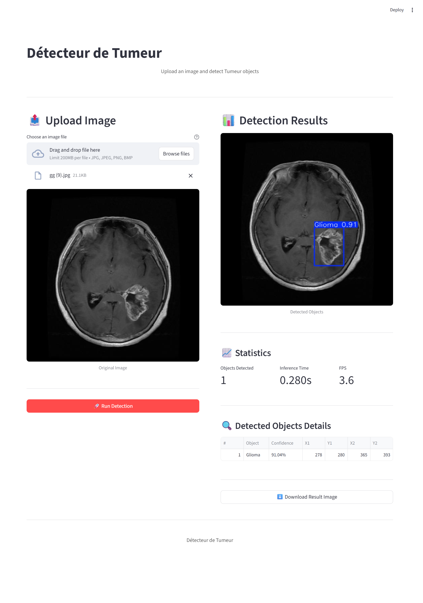

# Détection de tumeur & Classification de cellules cancéreuses

##  Contexte du projet

Vous êtes un développeur IA junior au sein d’un laboratoire biomédical spécialisé en **imagerie médicale**. Le laboratoire souhaite automatiser l’analyse de deux pathologies critiques :

1. **Les tumeurs cérébrales** (détection sur IRM ou scanner)
2. **Les leucémies** (classification de cellules sanguines sur frottis)

L’objectif est de concevoir une **solution unifiée** d’analyse d’images basée sur le **deep learning**, capable de détecter ou classifier automatiquement des anomalies à partir d’images médicales.

---

##  Partie 1 — Classification des cellules sanguines (PyTorch)

###  Objectif

Identifier si une cellule sanguine est **saine** ou **cancéreuse (leucémique)** à partir d’une image microscopique.

### 🔍 Fonctionnalités principales

* Vérification et nettoyage automatique du dataset (format d’image, doublons, erreurs).
* Comptage des images par classe et affichage d’un graphique de répartition.
* Visualisation d’un **échantillon représentatif** de chaque classe (cellules normales vs leucémiques).
* Découpage du dataset en trois ensembles :

  * 70 % pour l’entraînement
  * 15 % pour la validation
  * 15 % pour le test
* Application d’augmentations légères pour équilibrer les classes : flou, bruit, rotation, flip.
* Entraînement d’un **modèle pré-entraîné GoogLeNet** adapté à la tâche binaire.
* Suivi de la précision, de la perte et du taux de détection des cellules anormales.
* Sauvegarde du modèle final (`googlenet_blood_cells.pth`).

### 🖼️ Exemple visuel

**Échantillons du dataset de frottis sanguins :**

| Classe normale   | Classe leucémique     |
| ---------------- | --------------------- |
| 🩸 Cellule saine | 🧫 Cellule cancéreuse |

*(Image : cellules microscopiques colorées, fond clair, structure circulaire.)*

---

## 🧬 Partie 2 — Détection de tumeurs cérébrales (YOLOv8)

###  Objectif

Détecter la **présence** et **localiser** les tumeurs cérébrales à partir d’images d’IRM ou de scanner.

### 🔍 Fonctionnalités principales

* Filtrage des données : chaque image doit avoir un fichier de label (.txt) correspondant.
* Suppression des images sans labels et des labels sans images.
* Création automatique de la structure YOLO (train, val, test) avec répartition 70/15/15.
* Génération de deux fichiers de configuration :

  * `data.yaml` (sans augmentation)
  * `data2.yaml` (avec augmentation activée)
* Comptage du nombre d’images et de labels dans chaque ensemble.
* Entraînement de deux modèles YOLOv8 :

  * **YOLOv8 (No Aug)** — sans augmentations
  * **YOLOv8 (Aug)** — avec augmentations
* Évaluation des performances : mAP, précision, rappel.
* Sauvegarde du meilleur modèle (`best.pt` et `last.pt`).

### 🖼️ Exemple visuel

**Exemple d’IRM avec détection :**

| Image originale | Image détectée                    |
| --------------- | --------------------------------- |
| 🧠 IRM cerveau  | 📦 Boîte englobante sur la tumeur |

*(Image : zone de la tumeur entourée par un rectangle rouge avec la probabilité de détection.)*

---

## Liens Google Colab

- Notebook principal (entrainement / évaluation) : [Cliquez ici](https://colab.research.google.com/drive/1IP6nyFQqbOL2J5gAdVPX8AIUJMOl58hU?usp=sharing)

## 💡 Interface Streamlit — Application unifiée

###  Objectif

Créer une interface interactive pour tester et comparer les deux modèles.

### 🔍 Fonctionnalités principales

* Sélection du type d’analyse :

  * Classification des cellules sanguines
  * Détection de tumeur cérébrale
* Téléchargement d’une image (ou vidéo pour YOLO).
* Affichage du résultat directement dans l’interface :

  * Pour la classification : image + prédiction (Tumor / No Tumor)
  * Pour la détection : image avec boîtes englobantes et score de confiance
* Comparaison entre modèles avec ou sans augmentations.

### 🖼️ Exemple visuel Streamlit

                     |

---

## Résumé des résultats attendus

| Modèle    | Type           | Données            | Objectif            | Sortie                  |
| --------- | -------------- | ------------------ | ------------------- | ----------------------- |
| GoogLeNet | Classification | Cellules sanguines | Cancer / Non-cancer | Label + Probabilité     |
| YOLOv8    | Détection      | IRM cérébrales     | Localiser tumeurs   | Boîte + Score confiance |

---

## ✅ Résultats finaux attendus

* Un **modèle PyTorch** performant pour la classification de leucémie.
* Deux **modèles YOLOv8** pour la détection de tumeurs cérébrales.
* Une **interface Streamlit** intuitive permettant d’évaluer les performances visuelles et de tester les modèles sur de nouvelles images.

---

## 👨‍💻 Auteur

**Aamir El Amiri** — Développeur IA Junior 
**ABDELHAFID AIT EL MOKHTAR** — Développeur IA Junior

Projet : *Analyse et détection d’images médicales (tumeur & leucémie)*
